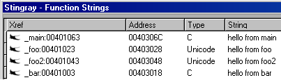

# Stingray 

Stingray is an IDAPython plugin for finding function strings. The search is from the current position onwards in the current function.
It can do it recursively also with configurable search depth. 
The results order is the natural order of strings in the BFS search graph. 

For each found string it displays the xref address, the string address, 
the string type and the of course the string itself.

## Stingray by Example

```C
#include <stdio.h>

void bar()
{
	printf("hello from bar\n");
}

void foo()
{
	wprintf(L"hello from foo\n");
	bar();
}

void foo2()
{
	wprintf(L"hello from foo2\n");
	bar();
}

void main()
{
	printf("hello from main\n");
	foo();
	foo2();

	getchar();
}
```

My Stingray was configured to recursive search we depth of 3.
I put the cursor on main function and hit Shift+S.
We get the following Stingray output:



Notice the Xrefs are clickable !
:)

## Requirements

- IDA (Hex Rays Interactive Disassembler) version >= 6 with IDAPython

## Installation

1. Copy src/Stingray.py file to the plugins directory of IDA (%IDAPATH%\plugins) 
and restart IDA.

2. You are ready to go :)

## Usage and Menus

load your favourite binary with IDA. 
To find strings in the current function from your position onwards 
hit **Shift+s**.

Stingray can also be found in Edit/Plguins/Stingray menu.

Stingray finds strings recursively ! you can configure the search depth in
the Stingray Config menu.

### Stingray Config

You can configure Stingray anytime from Options\Stingray Config menu.

You can configure the search depth. For non-recursive search mode
choose 0 depth.
